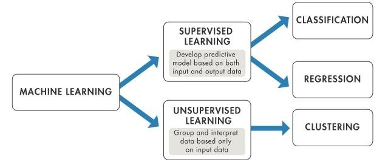

# Data Science and Machine Learning
## Author: Cesar Arias
## Instructor: Randy R. Davila

I am creating this repository to contain all my projects for my Data Science and Machine Learning
class. This course covers algorithms from supervised learning, unsupervised learning. In this repository you will find a large number of techniques in the field of machine learning.

## Content
### **Supervised Learning**
Supervised learning is just a subcategory of machine learning and AI. This type of learning uses datasets to train algorithms in classifying data or predicting outcomes accurately. The data sets that are inputed into supervised learning programs, help adjust weights until a model has been fitted. Supervised learning can be separated into two types of programs which are classification and regression. Classification uses algorithms to recognize specific qualities in data sets to conclude how they should be labeled of categorized as. While regression uses the information from the data sets in understanding the relationships between its dependent and independent variables.
- Model Building and Error Analysis \n
- Linear Regression
- Gradient Descent
- Logistic Regression
- Neural Nets
- Support Vector Machines
- k-Nearest Neighbors
- Decision/ Regression Trees
- Ensemble Learning

### **Unsupervised Learning**
Unsupervised learning uses machine learning algorithms to analyze and cluster unabeled datasets. This type of learning is able to discover patterns or groupings, by finding similarities and differences in the data sets its given.
- k-Means Clustering