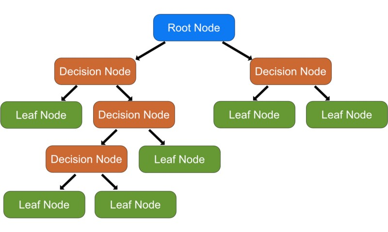

# Decision Trees
Using this type of model involves deciding on what features we need to choose and what conditions we need to use for splitting the data and when this splitting needs to stop. Classification trees can help predict the outcome to which the data belongs. Regression trees help predict continuous values in a data set. Now decision trees are more comonly reffered to as CART or classification and regression trees.

## DATA SET

The link to the data set used in this decision tree example is provided below. In this assignment we will cover some decision tree modeling with the data set "MoviesData".
[MovieDATA](https://www.kaggle.com/datasets/antallen/comparing-numerical-movie-review-scores)
Columns inside the data set
- Title
- Rating
- RTCritic
- RTFan
- IMDb
- Metacritic
- Box Office
- Year
- Action
- Animation
- Family
- Scifi
- Comedy
- Drama
- International
- Romance
- Horror
- Mystery
- Documentary

