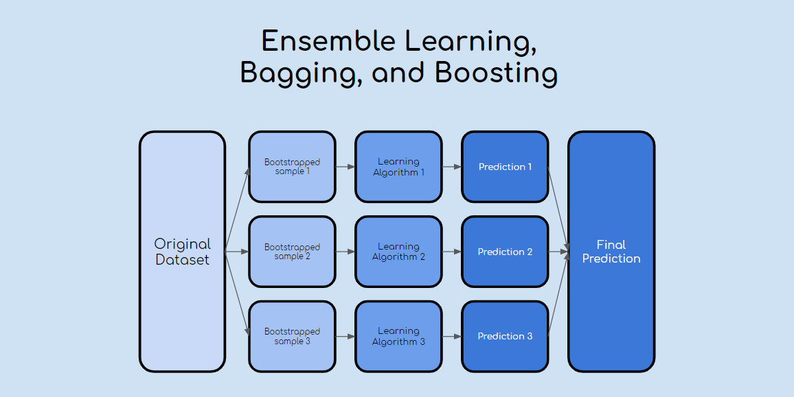

# Ensemble Learning

This type of learning is a general approach to machine learning that helps create better predictive performance by combining the predictions from multiply models. Three methods dominate the field of ensemble learning these are bagging, stacking and boosting methods. The bagging methods involves fitting decision trees on different samples in a single data set and then averaging these predictions. Stacking involves the fitment of different model types in a single data set and the use of anothe model to combine these predictions. Finally boosting involves the addition of ensemble members sequentailly that can correct previous predictions.

## DATA SET

The link to the data set used in this Ensemble Learning example is provided below. In this assignment we will cover some ensemble learning modeling with the data set "MoviesData".

Columns inside the data set
- Title
- Rating
- RTCritic
- RTFan
- IMDb
- Metacritic
- Box Office
- Year
- Action
- Animation
- Family
- Scifi
- Comedy
- Drama
- International
- Romance
- Horror
- Mystery
- Documentary

