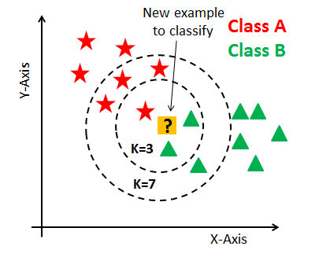

# K-Nearest Neighbors

The k-nearest neighbors algorithm, also known as KNN or k-NN, is a non-parametric, supervised learning classifier, which uses proximity to make classifications or predictions about the grouping of an individual data point. While it can be used for either regression or classification problems, it is typically used as a classification algorithm, working off the assumption that similar points can be found near one another.

## DATA SET

The link to the data set used in this KNN example is provided below. In this assignment we will cover some KNN modeling with the data set "winequality-red".

Columns inside the data set
- fixed acidity
- Weight
- volatile acidity
- citric acid
- Length3
- residual sugar
- chlorides
- free sulfur dioxide
- total sulfur dioxide
- density
- pH
- sulphates
- alcohol
- quality
