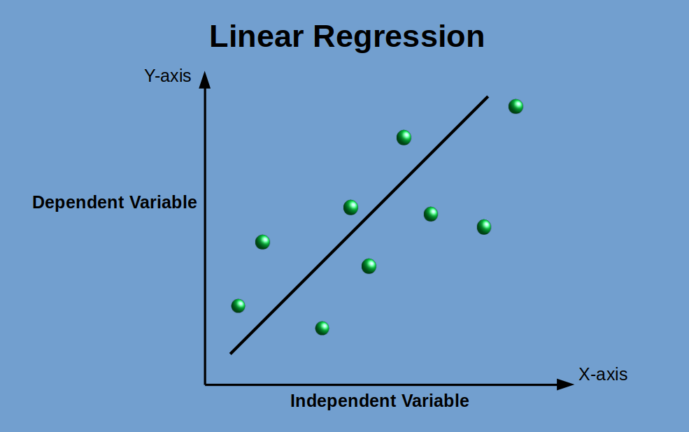

# Linear Regression

Linear regression is perhaps one of the most well known and well understood algorithms in statistics and machine learning. More specifically the field of predictive modeling is primarily concerned with minimizing the error of a model or making the most accurate predictions possible, at the expense of explainability. In applied machine learning we will borrow, reuse and steal algorithms from many different fields, including statistics and use them towards these ends.
As such, linear regression was developed in the field of statistics and is studied as a model for understanding the relationship between input and output numerical variables, but has been borrowed by machine learning. It is both a statistical algorithm and a machine learning algorithm.

The representation is a linear equation that combines a specific set of input values (x) the solution to which is the predicted output for that set of input values (y). As such, both the input values (x) and the output value are numeric.

## DATA SET

The link to the data set used in this linear regression example is provided below. In this assignment we will cover some linear regression modeling with the data set "Fish".

Columns inside the data set
- Species
- Weight
- Length1
- Length2
- Length3
- Height
- Width
