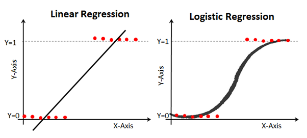

# Logistc Regression

Logistic regression is a process of modeling the probability of a discrete outcome given an input variable. The most common logistic regression models a binary outcome; something that can take two values such as true/false, yes/no, and so on. This is another powerful supervised ML algorithm used for binary classification problems (when target is categorical).The best way to think about logistic regression is that it is a linear regression but for classification problems.

## DATA SET

The link to the data set used in this linear regression example is provided below. In this assignment we will cover some linear regression modeling with the data set "winequality-red".
[Wine](https://www.kaggle.com/datasets/uciml/red-wine-quality-cortez-et-al-2009)
Columns inside the data set
- fixed acidity
- Weight
- volatile acidity
- citric acid
- Length3
- residual sugar
- chlorides
- free sulfur dioxide
- total sulfur dioxide
- density
- pH
- sulphates
- alcohol
- quality
