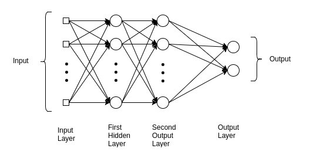

# Multilayer Perceptron

MLPs are global approximators and can be trained to implement any given nonlinear input-output mapping. In a subsequent testing phase, they prove their interpolation ability by generalizing even in sparse data space regions. It consists of three types of layers—the input layer, output layer and hidden layer. The input layer receives the input signal to be processed.The required task such as prediction and classification is performed by the output layer. An arbitrary number of hidden layers that are placed in between the input and output layer are the true computational engine of the MLP.

## Data Set
In this example we will be pulling from the keras package, specifically cifar10