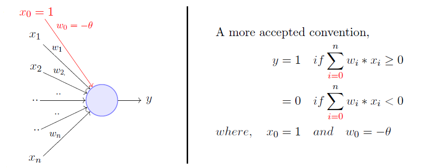

# Perceptron algorithm

The Perceptron algorithm is a two-class (binary) classification machine learning algorithm. The perceptron model is a more general computational model than McCulloch-Pitts neuron. It takes an input, aggregates it (weighted sum) and returns 1 only if the aggregated sum is more than some threshold else returns 0. Rewriting the threshold as shown above and making it a constant input with a variable weight, we would end up with something like the following: A single perceptron can only be used to implement linearly separable functions. It takes both real and boolean inputs and associates a set of weights to them, along with a bias (the threshold thing I mentioned above). We learn the weights, we get the function. Let's use a perceptron to learn an OR function.

